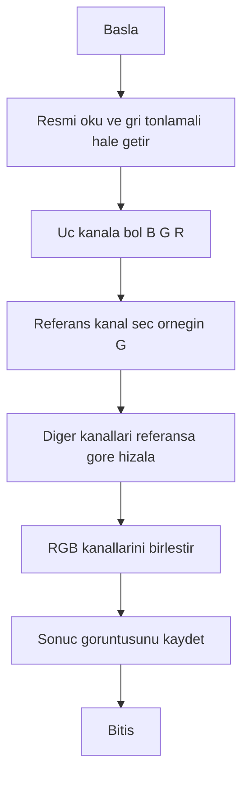
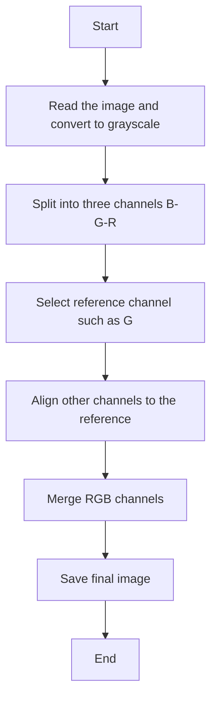

# Prokudin-Gorskii Image Alignment

Bu proje, Sergey Prokudin-Gorskii'nin 1900’lerin başında çektiği cam plaka fotoğraflarını yeniden birleştirerek **renkli görüntü elde etmeyi** amaçlar.  
Her görüntü, kırmızı (R), yeşil (G) ve mavi (B) filtrelerle ayrı ayrı çekilmiş siyah-beyaz fotoğraflardan oluşur.  
Proje bu kanalları **otomatik olarak hizalar** ve **tek bir renkli görüntü** haline getirir.

## 🚀 Özellikler
- RGB kanallarının otomatik ayrıştırılması  
- Kanal hizalama (cross-correlation veya edge detection ile)  
- Görüntü birleştirme ve renkli çıktı üretimi  
- NumPy, OpenCV ve Matplotlib kullanımı  
- Opsiyonel otomatik kaydırma (offset) tespiti  

## 📊 İşlem Akışı



## 🧩 Kullanılan Teknolojiler
- Python 3.8+
- OpenCV
- NumPy
- Matplotlib

## ⚙️ Kurulum
```bash
python -m venv venv
venv\Scripts\activate
pip install -r requirements.txt
```

## ▶️ Kullanım
```bash
python align_channels.py --input ./data/emir.tif --output ./results/emir_colorized.jpg
```

## 📊 Process Flow



## 🤝 Katkı
```bash
git clone https://github.com/09eesx/prokudin-gorskii-image.git
```

## 📜 Lisans
Bu proje MIT Lisansı ile lisanslanmıştır.
